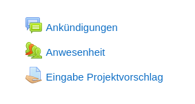

# Prüfung

Der Kurs erfordert zwei Semesternoten um die Abschlussnote zu bilden. Es wurde entschieden, dass erste (theoretische) Teil des Kurses mit einer [Wissensprüfung](#wissensprufung) bewertet wird und der zweite (praktische) Teil des Kurses mit einem [Leistungsnachweis](#leistungsnachweis) benotet wird.

## Termine

Dazu die Termine der Wissenprüfung und des Leistungsnachweises.

!!!include(exam-timetable.md)!!!

## Wissensprüfung
*Proof of Knowledge*

Ziel: Die Stundierenden verstehen die elemmentaren Bausteine der Programmierung und können die Python-Programmiersprache lesen und interpretieren.

Aufwand: 1-2 Stunden

### Abgrenzung

Die Inhaltliche Abgrenzung sind die Folien, Aufgaben und Wiederholungsfragen von [Teil 1](README.md#teil-1).

### Durchführung

Am Ende von Lektion 6 absolvieren die Studierenden eine online Moodle-Prüfung unter Aufsicht des Dozenten.

### Beispielfragen

Zur Orientierung werden 5 Beispiele für Augabenstellungen und Wissenfragen zur Verfügung gestellt:

1\. Der folgende Code ist fehlerhaft. Warum? Wie könnte eine Lösung aussehen?

```py
n=22.7
msg='Die Temperatur beträgt ' + n + ' Grad.'
```

2\. Wie führen Sie eine ganzzahlige Division durch? Schreiben sie den Python-Code auf.

3\. Ist die folgende Bedingung Wahr oder Falsch?

```py
true == 1
```

4\. Wir haben eine Liste und möchte das dritte Element ausgeben. Was geben sie für `X` ein?

```py
liste = ['Bern', 'Luzern', 'Zürich', 'Genf']
print(list[X])
```

5\. Ordnen sie Syntax den Aufzählungstypen zu:

1\. `[]` 2. `()` 3. `{}` 4. `{key: vlaue}`

Tupel: \_\_\
Set:  \_\_\
Dictionary:  \_\_\
Liste:  \_\_

## Leistungsnachweis
*Proof of Work*

Ziel: Eine Problem definieren und dieses mithilfe eines selbstgeschriebenen Programms lösen.

Aufwand: 12-20 Stunden

### Durchführung

Der Prozess für den Leistungsnachweis sieht wie folgt aus:
1. Studieren such sich eine Problemstellung oder Thema, dass sie mit einem Ptyhon-Programm lösen möchten
2. Die Studierenden formulieren dazu einen Projektvorschlag und laden diesen auf Moodle
3. Der Dozierende gibt eine Feedback und teilt mir, ob der Projektvorschlag den Erwartungen gerecht wird
4. Die Studieren haben Zeit um den Leistungsnachweis zu erarbeiten und eine Dokumentation zu erstellen
5. Der Dozierende gibt Inputs und kann bei Problemen kontaktiert werden
6. Die Studierenden laden das Resultat auf Moodle hoch
7. Der Dozierende macht eine Berwertung anhand der [Kriterien](#Kriterien)

### Resultat

Resultat sind zwei Dateien:
* `Code.zip`: Python-Programm (gezippter Ordner mit Pyton-Dateien)
* `Dokumentation.{pdf,epub,docx}:` Dokumentation zum Programm (4-8 Seiten, ohne Cover)

### Themenwahl

Hier einige Ideen für Projekte:

* Suche nach bestimmten Begriffen in [Log-Dateien](https://raw.githubusercontent.com/elastic/examples/master/Common%20Data%20Formats/nginx_logs/nginx_logs)
* Wort mit LED und Raspberry Pi als Morsecode ausgeben
* Daten aus Postgres Datenbank lesen und schreiben
* Wetter-Informationen abrufen und als HTML-Dokument ausgeben
* Tweet von Twitter-Account anzeigen lassen
* Datei auf Dropbox speichern
* Textbasiertes Hangman
* Detektion von Herzfrequenz anhand [EKG-Daten](https://github.com/janikvonrotz/python.casa/blob/main/ekg-data..csv)
* Temperaturdaten ploten und Min/Max bestimmen. Daten von  [https://sarneraa.huetstock.ch](https://sarneraa.huetstock.ch) können auf Anfrage bereitgestellt werden
* Passwortgenerator gemäss [xkcd-Comic](https://xkcd.com/936/)
* Covid-Daten mit Python verarbeiten und als HTML-Bericht präsentieren

### Projektvorschlag

Der Projektvorschlag wird auf Moodle mitgeteilt und besteht im wesentlichen aus einem Titel und einer kurzen Beschreibung (~100 Wörter).



### Dokumentation

Kapitelüberschriften der Dokumentation:

* **Einleitung**: Um was geht es in diesem Dokument?
* **Problemstellung**: Beschreibung des Problems.
* **Vorgehen**: Vorgehen um das Problem zu lösen. Visualisierung mittels Flowchart.
* **Umsetzung**: Wie wurde die Lösung effektiv implementiert? Beschreibung der wichtigsten Programm-Teile.
* **Rückblick**: Gab es Problem bei der Umsetzung? Was lief gut und was nicht?
* **Technische Anleitung**: Wie kann man das Program ausführen? Welche Vorbereitungen müssen getroffen werden?

::: tip
Auf <https://carbon.now.sh/> kann man seinen Code einfügen und als Bild darstellen lassen.

Mit [draw.io](https://draw.io) kann man Flowcharts erstellen und so den Code dokumentieren.
:::

Eine Vorlage für ein `.docx` kann [hier heruntergeladen](https://janikv.cloud/s/KaJ7zTdETxr8HAK) werden.

### Kriterien

Für jedes Kriterium werden Punkte von 0-9 vergeben. Jedes Kriterium wird mit 1-5 gewichtet.

**Qualität**

Gewichtung: 5

Leitfragen:
* Wurden der Code in Funktionen gruppiert?
* Sind die Anweisungen kommentiert?
* Kann ein Laie die Funktion des Programms nachvollziehen?
* Wurden Programmteile selbst verfasst oder kopiert?

**Herausforderung**

Gewichtung: 2

* Wurden Elemente wie Schleifen und Verzweigungen sinnvoll eingesetzt?
* Ist die Herausforderung dem HF-Niveau gerecht?
* Ist in der Reflexion ein Lerneffekt sichtbar?

**Inhalt**

Gewichtung: 4

* Wurden Strukturen aus den Lektionen sinnvoll eingesetzt?
* Liegt die Dokumentation in einem angemessen Umfang vor?
* Wurde der Code mit einem Flowchart sachgemäss visualisiert?
