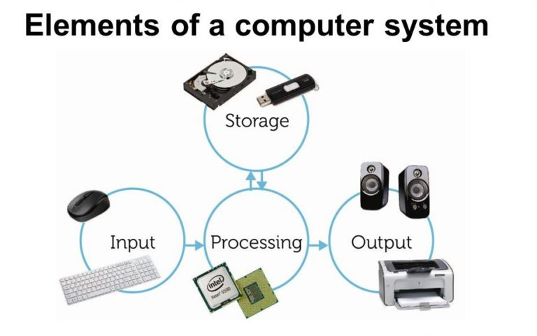
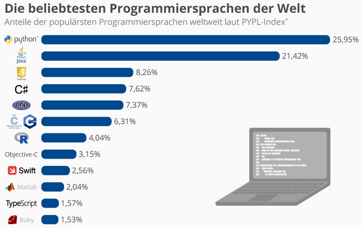
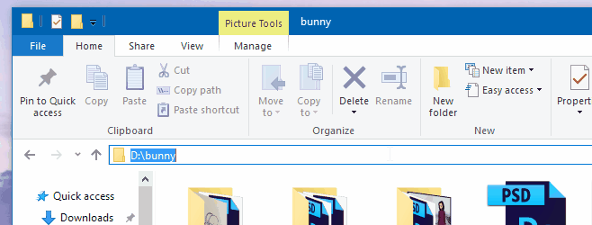

## Einführung Programmiersprache

[Thema 1](README.md)\
Umfang ⏱️: 3 Lektionen

⚡[Anwesenheit bestätigen](https://moodle.medizintechnik-hf.ch/mod/attendance/manage.php?id=6139) und Webcam einschalten.

📖 Kapitel 1 Hello, World!

---
### Der Computer ist einfach



---
### Begriffe der Programmierung

Umso schwieriger die Begriffe:
* Programmiersprache
* Syntax
* Anweisung
* Programmcode / Quellcode
* Deklarieren
* Variable
* IDE

---
### Programmiersprache

> Eine Programmiersprache ist eine formale Sprache zur Formulierung von Datenstrukturen und Algorithmen, d. h. von Rechenvorschriften, die von einem Computer ausgeführt werden können

---
### Anteile der Programmiersprachen



---
### Programmiersprache Python

<iframe src="https://giphy.com/embed/Wvfq2yFumK61W" width="280" height="280" frameBorder="0" class="giphy-embed" allowFullScreen></iframe>

* 1991 entwickelt
* Einfache Syntax und gute Lesbarkeit
* Universell anwendbar und Plattform unabhängig
* Beliebt in den Naturwissenschaften

---
### Installation Python

Installation via [Python Download](https://www.python.org/downloads).

Videos:
* [Python3 auf Windows 10 installieren](https://www.youtube.com/watch?v=hr1P_F7Vp9Y)  
* [Python3 auf MacOS installieren](https://www.youtube.com/watch?v=1xMT1Tzskrg)

⚡Aufteilung in Gruppen/Breakout-Rooms ⏱️ 10 Minuten

Ziel: Jeder hat Python installiert.

---
### Terminal

Wir machen unsere erste Schritte in der Python-Shell.

> Keine Angst vor dem Terminal

---
### Terminal starten

🎬 Auf MacOS: <kbd>cmd</kbd> + <kbd>leertaste</kbd> drücken, `Terminal` eingeben und `enter` drücken

🎬 Windows: <kbd>windows</kbd> + <kbd>r</kbd> drücken, `powershell.exe` eingeben und `enter` drücken

---
### Python-Shell starten

Wir starten nun die Python-Shell.

🎬 `python` im Terminal eingeben.

> Wir arbeiten mit Python 3.6 und höher.

Alternativ `C:\Program Files\Python\python.exe` öffnen.

---
### Anweistung interaktiv ausführen

🎬 Anweisung eingeben und mit <kbd>enter</kbd> bestätigen:

```py
print('Hello, World!')
```

---
### Anweisung

> Programmzeile mit Instruktionen, die vom Computer ausgeführt werden.

---
### Weitere Shell-Befehle

🎬 Anweisung eingeben:

```py
name='Michael'
print('Hallo ' + name + '!')
```

---
### Variable deklarieren

Links Name des Speichers und Rechts der Wert.

```py
irgendwas = 'Ein Text'
```

Hier wird die Variable `irgendwas` mit dem Wert `'Ein Text'` deklariert.

---
### Syntax

> Unter Syntax versteht man allgemein ein Regelsystem zur Kombination elementarer Zeichen zu zusammengesetzten Zeichen in natürlichen oder künstlichen Zeichensystemen.

---
### Programmcode herunterladen

Wir laden ein Programmcode herunter und speichern ihn in einem Ordner.

🎬 Folgende Punkte erledigen:
* Projektordner und Unterordner `Thema1` erstellen
* Datei-Link [HelloWorld.py](https://raw.githubusercontent.com/janikvonrotz/python.casa/main/topic-1/HelloWorld.py) öffnen
* Speichern als `HelloWorld.py` im neuen Ordner.

---
### Programmcode

> Quelltext, auch Quellcode oder unscharf Programmcode genannt, ist in der Informatik der für Menschen lesbare, in einer Programmiersprache geschriebene Text eines Computerprogrammes.

---
### Programmcode ausführen

Im Unterordner das Terminal starten.

🎬 Folgende Punkte erledigen:

* Ordner im Explorer/Finder öffnen
* Windows: In Adressleiste `powershell.exe` eingeben und mit `enter` bestätigen



* MacOS: In Finder Rechtsklick auf den Ordner machen und Terminal in Ordner starten.

---
### Programmcode ausführen

🎬 Programm in Terminal ausführen 

```bash
python ./HelloWorld.py
```

ℹ️ Unter MacOS und GNU/Linux muss das Programm mit `chmod +x ./HelloWorld.py` ausführbar gemacht werden.

---
### Shebang

```py
#!/usr/bin/env python3
```

Was hat es mit der ersten Zeile auf sich?

GNU/Linux und MacOS: -> `python`

Windows: `.py` -> `python.exe`

---
### Installation IDE

IDE=Integrierte Entwicklungsumgebung  

IDE-Editor [Thonny](https://thonny.org/) installieren. Wählt als Sprache `English` und Einstellung `Standard`.

⚡Aufteilung in Gruppen/Breakout-Rooms ⏱️ 10 Minuten

Ziel: Jeder kann die IDE starten.

---
### Skript öffnen

🎬 Folgende Aktionen ausführen:
* Das Skript `HelloWorld.py` in der IDE öffnen
* Den Ausgabe-Text ändern und speichern
* Das Skript mit der IDE oder dem Terminal ausführen

---
### Was läuft hier?

* Quellcode wird direkt vom Interpreter (Python) ausgeführt
* Programmcode wird kompiliert
* Program wird als C-Code ausgeführt

---
### Was passiert beim kompilieren?


---
### Anweisungen ein- und mehrzeilig

Ist normalerweise Einzeilig.

```py
print('abc')
print('efg')
```

Mehre Anweisungen auf einer Zeile:

```py
a=1; b=2; c=3
```

---
### Blockelemente

Sprachelemente über mehrere Zeilen.

```py
if xxx:
    anweisung1a
    anweisung1b
else:
    anweisung2a
```

Anweisungen müssen eingeruckt sein.

---
### Input

Eingabe des Benutzers empfangen und ausgeben.

```py
name = input('Geben Sie Ihren Namen an:')
print('Ihr Name lautet:', name)
```

---
### Kommentare

Kommentieren direkt im Code.

```py
# ein Kommentar
print('abc')  # noch ein Kommentar
```

---
### Aufgaben

Lösen sie die Aufgaben und besprechen sie die Wiederholungsfragen.

⚡Aufteilung in Gruppen/Breakout-Rooms ⏱️ 10 Minuten

Ziel: Aufgabe 1.1 gelöst.

---
### Review

Ziele erreicht?
* Python ist installiert und interaktiv verfügbar
* Erstellen und Ausführen von Skripten funktioniert
* Vorgang Kompilierung verstanden

---
### Feedback

<iframe src="https://giphy.com/embed/UVZCz81UWkobY3oHbd" width="300" height="300" frameBorder="0" class="giphy-embed" allowFullScreen></iframe>

* Was lief gut?
* Was kann ich verbessern?

---
### Zum Schluss

Wir haben noch Zeit für:

* Besprechung von Aufgaben und Wiederholungsfragen
* Fragen zum Thema
* Direkte Unterstützung Studierende

---
### Quellen

[^1]: <https://de.statista.com/infografik/16544/anteile-der-populaersten-programmiersprachen-weltweit/>