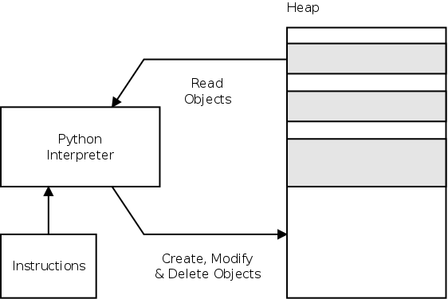
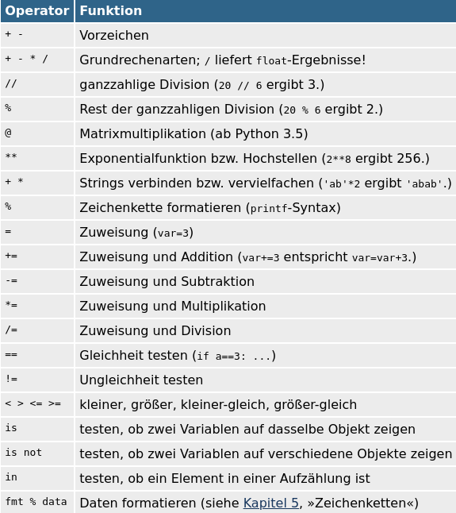

## Variablen und Datentypen

[Thema 2](readme.md)

⚡[Anwesenheit bestätigen](https://moodle.medizintechnik-hf.ch/mod/attendance/manage.php?id=4479)

📖 Kapitel 2 Variablen, 3 Operatoren und 4 Zahlen

---
### Besprechung Thema 1

* Ziele erreicht?
* Aufgaben und Wiederholungsfragen

---
### Variablen

Programm speichert vorübergehend Werte, Zeichenketten und andere Informationen.

Variable deklarieren:

```py
a = 1
b = 'abc'
```

---
### Datentypen

Es gibt verschiedene Typen zum Speichern von Daten.


---
### Lebensdauer

Variablen leben bis zum Programmende.

Beim Start eines Programms wird es in den Arbeitsspeicher (Memory) geladen


---
### Der Heap

Im sogenannten Heap speichert Python die Werte der Variablen



---
### Fensterdarstellung wechseln 1

Für den weiteren Verlauf des Unterrichts arbeiten wir mit Thonny und der Website gleichzeitig. Dazu wechseln wir die Fensterdarstellung.

---
### Fensterdarstellung wechseln 2

🎬 Folgende Aktion ausführen:
* Thonny öffnen und das Fenster auf die linke Seite schieben
	* Windows: <kbd>windows</kbd> + <kbd>←</kbd> drücken
* [ptyhon.casa - Thema 2 Slides](https://python.casa/topic-2/slides.html) öffnen und auf die rechte Seite schieben
	* Windows: <kbd>windows</kbd> + <kbd>→</kbd> drücken

---
### Heap anzeigen

Mit Thonny können wir sehen wie Python die Variablen und deren Werte verwaltet.

🎬 In Tonny Menu *Ansicht* anwählen und die Optionen *Heap* und *Variablen* aktivieren.

---
### Variablen anzeigen

> Variablen sind lediglich Referenzen

🎬 Folgende Aktionen in Thonny ausführen:
* Neues leeres Skript erstellen
* Datei speichern im neuen Ordner `Thema2` als `Heap.py`
* Anweisung `x=1` eingeben und ausführen

---
### Ergebnis Heap

Eine Variable ist eine Referenz zu einem Eintrag im Heap.


---
### Datentyp anzeigen

Variablen haben keinen Typ, aber deren Wert.

🎬 Im Programm `Heap.py` diesen Code anfügen und ausführen.

```py
print(type(x)) # Ausgabe: <class 'int'>
```

---
### Typumwandlung automatisch

Bei Berechnungen wandelt Python automatisch den Typ um.

🎬 Datei `Umwandlung.py` erstellen, Code eingeben und ausführen.

```py
a = 2 # int
b = 2.4 # float
c = a*b # auch float
print(c) # 4.8
```

---
### Typumwandlung manuell

Im Normalfall müssen Typumwandlungen explizit festgelegt werden.

🎬 Datei `Umwandlung.py` mit Code erweitern und ausführen.

```py
s = 'abc' # str
x = 3 # int
s = s + str(x)
print(s) # Ergebnis 'abc3'
```

---
### Pause

⚡Wir machen eine Pause ⏱️ 10 Minuten

<iframe src="https://giphy.com/embed/RicRd3dDNQJM3fmkzt" width="280" height="280" frameBorder="0" class="giphy-embed" allowFullScreen></iframe>

---
### Gültigkeitsbereich

Ist eine Variable einmal definiert, kann sie weiterverwendet werden.

```py
if 1: # das ist immer erfüllt
    x=1 # daher wird diese Zuweisung ausgeführt
print(x) # ok, Ausgabe 1
```

```py
if 0: # das ist nie erfüllt
    x = 1 # daher wird diese Zuweisung nicht ausgeführt
print(x) # Fehler: name 'x' is not defined
```

---
### Zahlen

Python ...
* hat einen nahezu unendlich grossen Zahlenraum
* unterstützt komplexe Zahlen
*  kann Zufallszahlen generieren

---
### Operatoren



---
### Division

Gewöhnliche Division liefert immer Fliesskommazahlen.

```py
print(2/3, 6/3) # Ausgabe: 0.6666666666666666 2.0
```

Für ganzzahlige Division `//` verwenden.

```py
print(2//3, 6//3) # Ausgabe: 0 2
```

🎬  Führen sie die Divisionen aus.

---
### Runden

🎬  Zum Runden die Funktion `round` verwenden.

```py
print(round(1.5)) # Ausgabe: 2
print(round(1.4)) # Ausgabe: 1
```

ℹ️ Mit `help(round)` erfahren sie mehr zur Funktion.

---
### Zufallszahl generieren

> Die Vertrauenswürdigkeit jeder Verschlüsselung basiert auf der Korrektheit von Zufallszahlen.

Zusätzliche Funktionen können mit `import` importiert werden.

```py
from random import randint
print(randint(0, 7))
```

🎬  Generieren sie eine Zufallszahl von 1 bis 10.

---
### Boolsche Werte

Boolsche Werte kennen zwei Zustände.

🎬  Führt das folgende Skript aus:

```py
a = True
b = 7==8
c = not 0
d = int(False)
print(a,b,c,d)
```

---

### Aufgaben

Lösen sie die Aufgabe 2.1 und besprechen sie die Wiederholungsfragen.

⚡Aufteilung in Breakout-Rooms ⏱️ 10 Minuten

Ziel: Aufgabe 2.1 gelöst.

---
### Review

🎯 Ziele erreicht?
* Variablen deklarieren und verwenden
* Datentypen verstanden
* Einfach Berechnungen ausführen

---
### Abschluss

📝 Ich bitte euch die restlichen Aufgaben und Wiederholungsfragen im Selbststudium durchzugehen.

👋 Bis zum nächsten Mal.