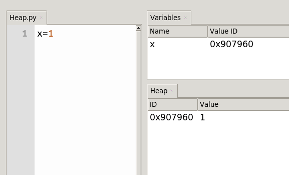

## Variablen und Datentypen

[Thema 2](topic-2/readme.md)

⚡[Anwesenheit bestätigen](https://moodle.medizintechnik-hf.ch/mod/attendance/manage.php?id=4479)

📖 Kapitel 2 Variablen und 4 Zahlen

---
### Besprechung Thema 1

* Ziele erreicht?
* Aufgaben und Wiederholungsfragen

---
### Variablen

Programm speichert Werte, Zeichenketten und andere Informationen vorübergehen.

Variable deklarieren:

```py
a = 1
b = 'abc'
```

---
### Datentypen

Es gibt verschiedene Typen zum Speichern von Daten.


---
### Lebensdauer

Variablen leben bis zum Programmende.

Beim Start eines Programms wird es in den Arbeitsspeicher (Memory) geladen


---
### Der Heap

Im sog. Heap speichert Python die Werte der Variablen


---
### Heap anzeigen

Mit Thonny können wir sehen wie Python die Variablen und deren Werte verwaltet.

🎬 Thonny IDE öffnen und im Menu *Ansicht* die Optionen *Heap* und *Variablen* aktivieren.

---
### Variablen anzeigen

> Variablen sind Referenzen

🎬 Folgende Aktionen in Thonny ausführen:
* Neues leeres Skript erstellen
* Speichern im Ordner `Thema2` als `Heap.py`
* Folgende Anweisung eingeben und ausführen:

```py
x=1
```

---
### Ergebnis

Eine Variable ist eine Referenz zu einem Eintrag im Heap.



Wie verwaltet Python Datentypen?

---
### Datentyp anzeigen

Variablen haben keinen Typ, aber deren Wert

🎬 Im Programm `Heap.py` diesen Code anfügen und ausführen.

```py
print(type(x))
```

---
### Typumwandlung

---
### Gültigkeitsbereich

Ist eine Variable einmal definiert, kann sie weiterverwendet werden.

```py
if 1:      # das ist immer erfüllt
  x=1      # daher wird diese Zuweisung ausgeführt
print(x)   # ok, Ausgabe 1
```

```py
if 0:         # das ist nie erfüllt
    x = 1     # daher wird diese Zuweisung nicht ausgeführt
print(x)      # Fehler: name 'x' is not defined
```

---
### 
