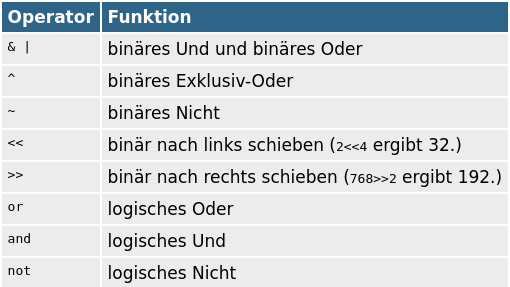
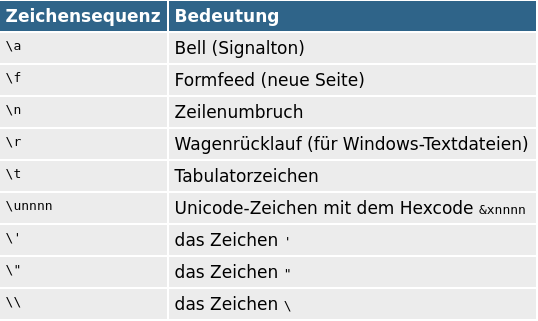
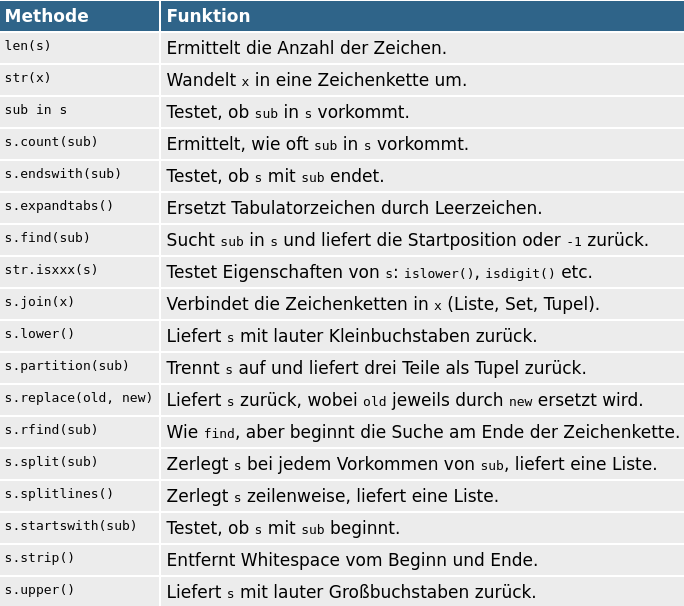

## Boolsche Algebra  und Zeichenketten

[Thema 3](README.md)\
Umfang ⏱️: 2 Lektionen

⚡[Anwesenheit bestätigen](https://moodle.medizintechnik-hf.ch/mod/attendance/manage.php?id=6139) und Webcam einschalten.

📖 Kapitel 3 Operatoren und 5 Zeichenketten

---
### Herkunft Boolean

* Boolean sind benannt nach Georg Boole (1815)
* Er gründete die moderne mathematische Logik

> Seinen Arbeiten verdanken wir den Computer

---
### Boolsche Algebra

Im Programmieren sind wir immer mit logischen Problemstellungen konfrontiert.

Boolsche Algebra hilft uns diese Probleme zu lösen.

---
### Binäre und logische Operatoren



---
### Gesetze

In den nächsten Slides schauen wir uns die Gesetze[^1] der boolschen Algebra an.

🎬 Deklariert diese Variablen in der Python-Shell:

```py
a = True
b = False
```

---
### Konjunktion

🎬 In der Python-Shell ausführen:

```py
a and b
```

---
### Disjunktion

🎬 In der Python-Shell ausführen:

```py
a or b
```

---
### Negation

🎬 In der Python-Shell ausführen:

```py
not a
not b
```

---
### Absorption

🎬 In der Python-Shell ausführen:

```py
(a or (a and b)) == a
(a and (a or b)) == a
```

---
### Doppelte Negation

🎬 In der Python-Shell ausführen:

```py
(not not a) == a
```

Es gibt noch [viele weitere Gesetze](../topic-2/archive.md).

---
### Short-Circuit-Evaluation

Evaluation wird abgebrochen sobald Ergebnis feststeht.

```py
x = True
y = False
y and (x and y) or (y and x) # Evaluation wird nach y abgebrochen
x and (x and y) or (y and x) # Evaluation vollständig geprüft
```

---
### Wahre Werte

Die meisten Werte sind wahr.

```py
bool("abc")
bool(123)
bool(["apple", "cherry", "banana"])
```

---
### Falsche Werte

Andere Werte sind falsch.

```py
bool(False)
bool(None)
bool(0)
bool("")
bool(())
bool([])
bool({})
```

---
### Aufgaben 1

Lösen sie die ersten zwei [Aufgaben](excercise.md#aufgaben).

⚡Aufteilung in Gruppen/Breakout-Rooms ⏱️ 10 Minuten

Ziel: Aufgabe 3.1 und 3.2 gelöst.

---
### Grundregeln Zeichenketten

* Wichtigkeit: Zeichenketten > Zahlen
* Python macht den Umgang mit Zeichenketten relativ leicht

```py
s='abc'
print(type(s)) # <class 'str'>
```

---
### Apostrophe

Einfache oder doppelte Apostrophe sind gleichwertig.

```py
'abc' == "abc"
```

---
### Mehrzeilige Zeichenketten

🎬 Erstellen sie eine mehrzeilige Zeichenkette:

```py
s = """Das ist
       eine lange
    Zeichenkette."""
print(s)
```

ℹ️ Zeilenumbrüche werden mit der Escape-Sequenzen `\n` gespeichert.

---
### Zeichenketten kombinieren

🎬 Folgende Aktionen ausführen:
* Ordner `Thema3` und Datei `Zeichenketten.py` erstellen
* Geben sie den folgenden Code ein:

```py
s1 = 'abc'
s2 = 'efg'
s3 = s1 + s2 + s1
print(s3) # Ergebnis 'abcefgabc'
```

---
### Zeichenketten vervielfältigen

```py
s1 = 'abc'
s2 = s1*3 + 'x'*2
print(s2) # Ergebnis 'abcabcabcxx'
```

---
### Pause

⚡Wir machen eine Pause ⏱️ 10 Minuten

<iframe src="https://giphy.com/embed/pp6pC4XgyDOiQ" width="280" height="280" frameBorder="0" class="giphy-embed" allowFullScreen></iframe>

---
### Sonderzeichen

Sonderzeichen können mit Escape-Sequenzen eingebettet werden.



```py
print("Hallo\nWelt")
```

---
### Raw-Zeichenketten

Python interpretiert \\-Sequenzen als Sonderzeichen, um das zu vermeiden, stellen sie den Buchstaben r (raw) voran:

```py
latexcode = r'\section{Überschrift}'
```

---
### Teilzeichenketten

Mit der Slicing-Syntax `s[start:ende]` kann auf Teile einer Zeichenkette zugegriffen werden.

🎬  Erstellen sie die Datei `Teilzeichenketten.py`

---
### Zugriff Teilzeichenketten

🎬  Führen sie die folgenden Zeilen aus:

```py
s='abcdefghijklmnopqrstuvwxyz'
print(s[3]) # Viertes Zeichen
print(s[3:6])
print(s[:3]) # Alles bis und mit dem dritten Zeichen
print(s[-4]) # Das viertletzte Zeichen
print(s[-4:]) # Alles ab dem iertletzten Zeichen
```

---
### Schrittweite

Mit dem dritten Parameter kann die Schrittweite angegeben werden.

🎬  Fügen sie diese Zeilen an:

```py
print(s[::2]) # jedes zweite Zeichen
```

---
### Zeichenketten umkehren

Mit negativen Schrittweite kehrt die Reihenfolge:

```py
print(s[::-1]) # alles in umgekehrter Reihenfolge
print(s[::-2]) # Jedes zweite Zeichen in umgekehrter Reihenfolge
```

---
### Zeichenkettenfunktionen

Zeichenketten können mit vielen Funktionen und Methoden bearbeitet werden.



---
### ℹ️ Funktionen versus Methoden

Methoden sind etwas Ähnliches wie Funktionen, sie werden aber direkt auf die zugrundeliegenden Daten (Objekte) angewendet.

```py
funktion(daten)
daten.methode(weitere, daten)
```

---
### Anwendungsbeispiele Methoden

🎬  Erstellen sie die Datei `Methoden.py` mit diesem Inhalt:

```py
s='abcdefghijklmnopqrstuvwxyz'
print(s.upper()) # Alles in Grossbuchstaben
print(s.count('efg')) 
```

---
### Eigenschaften ermitteln

Mit `str.isxxx`-Funktionen können sie Zeichenketten nach bestimmten Eigenschaften testen.

🎬  Erstellen sie die Datei `Eigenschaften.py` mit diesem Inhalt:

```py
print(len('abc')) # 3
print(str.isalpha('abcäöü')) # True
print(str.isalpha('abc123')) # False
print(str.isdigit('123')) # True
print(str.isalnum('abc123')) # True
print(str.isascii('abc123|$!')) # True
print(str.islower('abcD')) # False
```

---
### Suchen

🎬 Führen sie diese Aktionen aus:
* Datei `Suchen.py` erstellen
* Diesen Code einfügen und ausführen:

```py
s="abcdefghijklmnopqrstuvwxyz"
print(s.find("hij")) # Ergebnis: 7
print(s.find("hij",8)) # -1 also nicht gefunden
print(s.rfind("hij")) # Suche von Rechts nach Links
```

ℹ️ Beim Zugriff auf die Startposition muss 1 dazugezählt werden.

---
### Ersetzen

🎬 Fügen sie diesen Code an die letzte Datei:

```py
print(s.replace('e', 'X'))
```

---
### Daten formatieren

Es gibt mehrere Ansätze zum Formatieren von Zeichenketten:
* %-Operator
* format-Methode
* format-Kurzschreibweise

🎬 Erstellen sie eine Datei `Formatierung.py`

---
### Formatierung mit %-Operator

🎬 Führen sie diesen Code aus:

```py
print('%s ist %d Jahre alt.' % ('Matthias', 11))
print('1/7 mit drei Nachkommastellen: %.3f' % (1/7))
```

---
### Formatierung mit format-Methode

🎬 Führen sie diesen Code aus:

```py
print('{} ist {} Jahre alt.'.format('Sebastian', 13))
print('{name} ist {alter} Jahre alt.'.format(alter=13, name='Sebastian'))
```

---
### Formatierung mit format-Kurzschreibweise

🎬 Führen sie diesen Code aus:

```py
alter=26/3
name='Sebastian'
print(f'{name} ist {alter:.3} Jahre alt.')
```

ℹ️ Diese Formatierung ist ab Python 3.6 verfügbar.

---
### Aufgaben 2

Lösen sie die nächsten zwei [Aufgaben](excercise.md#aufgaben).

⚡Aufteilung in Gruppen/Breakout-Rooms ⏱️ 10 Minuten

Ziel: Aufgabe 3.3 und 3.4 gelöst.

---
### Review

🎯 Ziele erreicht?
* Gesetze der boolschen Algebra sind bekannt
* Zeichenketten können erstellt, bearbeitet und formatiert werden
* Das Erstellen von Skripten ist inzwischen kein Problem

---
### Abschluss

📝 Ich bitte euch die restlichen Aufgaben und Wiederholungsfragen im Selbststudium durchzugehen.

👋 Bis zum nächsten Mal.

---
### Referenzen

[^1]: [Wikipedia - Boolesche Algebra](https://de.wikipedia.org/wiki/Boolesche_Algebra#Definition)
