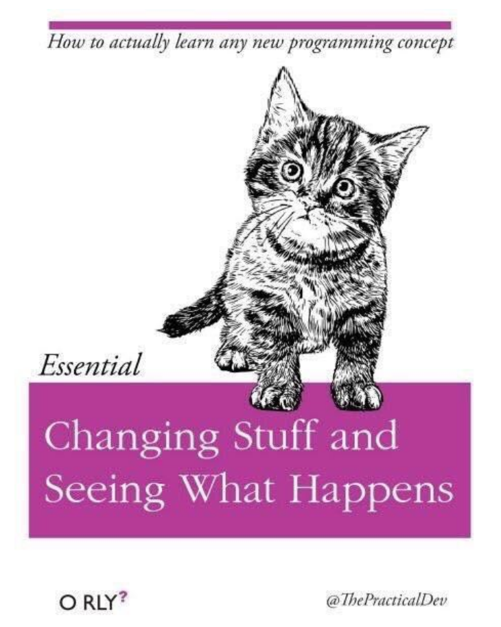

## Kontrollstrukturen und Listen

[Thema 4](readme.md)

⚡[Anwesenheit bestätigen](https://moodle.medizintechnik-hf.ch/mod/attendance/manage.php?id=4479) und Webcam einschalten.

📖 Kapitel 7 Listen, Tupel, Sets und Dictionairies
📖 Kapitel 8 Verzweigungen und Schleifen

---
### Rückblick

Besprechung der Wiederholungsfragen.

---
### Überblick

Thema 4:
* Listen, Tupel, Sets und Dictionaries
* Verzweigungen und Schleifen

Thema 5:
* Funktionen
* Python in der Praxis

---
### Listen, Tupel, Sets und Dictionaries

* Mehre Variablen als Daten speichern
* Aufzählungen verarbeiten

---
### Übersicht Aufzählungsypen

* **Listen**: Wichtigster und flexibelster Datentyp
* **Tupel**: Verwendung für zusammenhängende Daten
* **Sets**: Ungeordnete Menge ohne Doppelgänger
* **Arrays**: Spielt eine untergeordnete Rolle

---
### Listen

* Kann einen bliebigen Datentyp aufnehmen
* Formulierung mit `[]`-Klammern

---
### Liste deklarieren

---
### range-Funktion

---
### Umwandlung Zeichenkette

---
### List Comprehension

### Pause

### Übungen 1

