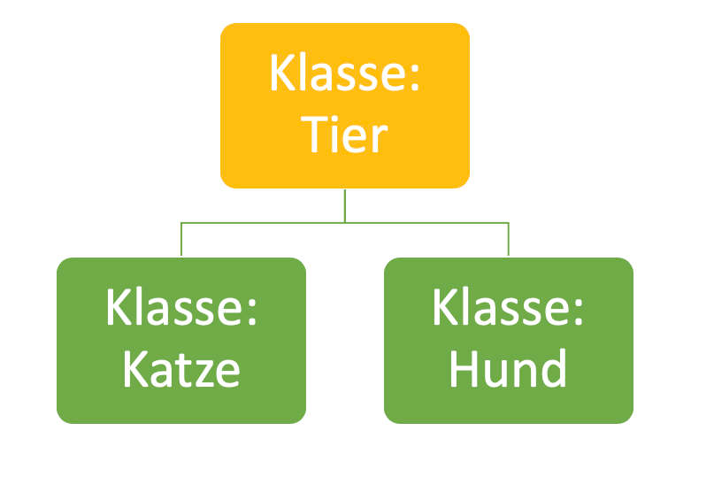
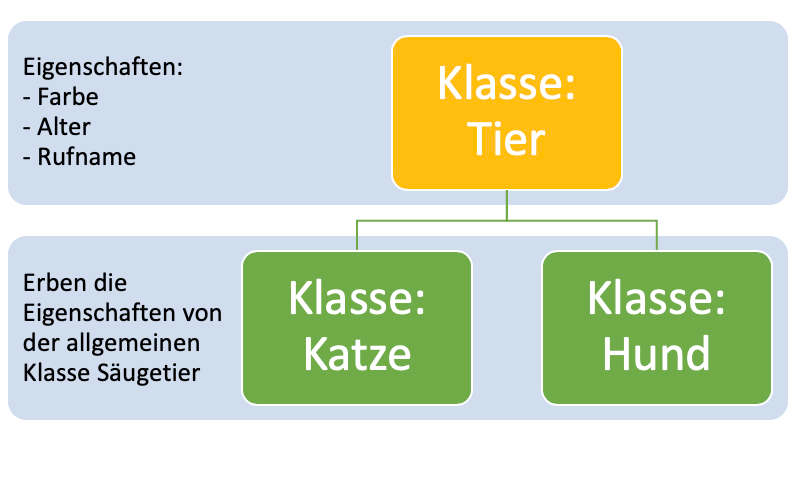

## Objektorientierte Programmierung

[Thema 5.5](./README.md)

⚡[Anwesenheit bestätigen](https://moodle.medizintechnik-hf.ch/mod/attendance/manage.php?id=6139) und Webcam einschalten.

📖 Kapitel 11 Funktionen

---

### Code Aufbau

Bis anhin haben wir funktional programmiert.

Abhängig von der Projektgrösse muss man Code entsprechend aufbauen.

Python unterstützt auch die objektorientierte Programmierung (OOP).

---

### Daten und Code

Sie Idee von OOP ist die Bündelung von Daten (Variablen) und Code (Methoden)


---

### Objekte und Klassen

Es gibt neue Begriffe.

* **Klasse**: Bauplan oder wie das Objekt aussehen soll
* **Objekt**: Alles ist ein Objekt, beispielsweise Personen, Autos, Bäume, Häuser, Länder, Werkzeuge und Schuhe

---

### Beispiel Auto

Eine Veranschaulichung anhand des Objekts Auto.


---

### Modelierung der Realität

Mit OOP versucht man reale Objekte in Code auszudrücken.

Im Folgenden wollen wir die Funktionsweise einer Kaffeemaschine mit Code ausdrücken.

---

### Eine Klasse definieren

🎬 Erstellen sie die Datei `Kaffeemaschine.py` mit diesem Inhalt:

```py
class Kaffeemaschine:
    def __init__(self, marke, anzahl):
        self.marke = marke
        self.anzahl = anzahl
    
    def Zustand(self):
        print(f"Ich bin eine {self.marke} Maschine")
        print(f"Es sind noch {self.anzahl} Kaffee(s) verfügbar")
    
    def Bestellen(self, anzahl):
        self.anzahl -= anzahl
```

ℹ️ Wir haben hier den Bauplan für eine Kaffeemaschine. Nun können wir beliebig viele Kaffeemaschinen erstellen.

---

### Objekt instanzieren

Nun erstellen wir anhand des Bauplans eine Kaffeemaschine.

🎬 Fügen sie diesen Code an:

```py
# Instanzieren
kaffeemaschine = Kaffeemaschine('Nespresso', 3)

# Methoden aufrufen
kaffeemaschine.Bestellen(2)
kaffeemaschine.Zustand()
```

---

### Lebenszyklus eines Objekts

1. Objekt instanzieren
	1. Konstruktor `__init__` aufrufen
2. Objektmethoden aufrufen
3. Objekt löschen (Progamm Ende)

---

### Initialisierung / Konstruktor

Die Initialisierung übernimmt der Konstruktor. Der Konstruktor ist eine Funktion mit dem Namen `__init__`.

```py
def __init__(self, marke, anzahl):
```

---

### Selbstbezug / Instanzvariablen

`self` bezieht sich auf das Objekt (die Instanz) selbst. Die self-Variablen nennt man Instanzvariablen.

```py
self.marke = marke
self.anzahl = anzahl
```

---

### Interaktion / Methoden

Mittels Methoden interagiert man mit dem Objekt.

```py
def Zustand(self):
	print(f"Ich bin eine {self.marke} Maschine")
	print(f"Es sind noch {self.anzahl} Kaffee(s) verfügbar")

def Bestellen(self, anzahl):
	self.anzahl -= anzahl
```

---

### Aufgaben 1

Lösen sie die ersten zwei Aufgaben.

⚡Aufteilung in Gruppen/Breakout-Rooms ⏱️ 10 Minuten

Ziel: Aufgabe 5.5.1 und 5.5.2 gelöst.

---

### Bestehende Python-Klassen

Sie haben bereits bestehende Python-Klassen verwendet. Beispielsweise die Klasse `date`.

```py
from datetime import date
today = date.today()  
```

Dazu der [Klassen-Code in der Python-Bibliothek](https://github.com/python/cpython/blob/86d18019e96167c5ab6f5157fa90598202849904/Lib/datetime.py#L762).

---

### Klassen- und Instanzvariablen

Man unterscheidet zwischen Klassen- und Instanvariablen.

**Instanzvariablen**:  Alle Variablen, denen `self` vorangestellt wird, sind Instanzvariablen.

**Klassenvariablen**: Variablen, die auf Klassenebene definiert werden, gehören zur Klasse, nicht zu einzelnen Objekten

---

### Beispiel Klassen- und Instanzvariablen

```py
class MyClass():  
    magicNumber = 42 # Klassenvariable
    def __init__(self, somedata, otherdata):
        somevar = 123 # lokale Variable
        self.data = somedata # Instanzvariablen
        self.other = otherdata
```

ℹ️ Attribute ist ein Sammelbegriff für Variablen und Methoden von Klassen bzw. Objekten.

---

### Dekoratoren

Dekoratoren werden mit `@` eingeleitet und dienen als Zusatzattribute für Funktionen, Methoden oder Klassen. Sie können die Intention von Code verdeutlichen und Informationen an den Python-Interpreter bzw. -Compiler weitergeben.

```
@hello
def name():                                                                                                 
    print("Alice")  
```

---

### Beispiel Dekoraten

🎬  Erstellen sie eine Datei `Dekoraten.py`, fügen sie den Code von unten ein.

```py
# Dekoraten-Funktion
def hello(func):                                                                                            
    def inner():                                                                                            
        print("Hello ")                                                                                     
        func()                                                                                              
    return inner                                                                                 

# Funktion wird mit Dekorator erweitert
@hello
def name():                                                                                                 
    print("Alice")                                                                                          
                                                                                                                                                                                
name()
```

ℹ️ Durch das "dekorieren" einer Methode ändert man die "Wirkung".

---

### Getter- und Setter-Methoden

Der Konstruktor wird nur einmal ausgeführt. Bestimmte Variabeln kann man nicht mehr ändern. Mit Getter- und Setter-Methoden ermöglicht man den Zugriff auf diese Variablen.

```py
class Kaffeemaschine:
    def __init__(self, name):
        self._name = name
    
    @property
    def name(self):
        return self._name
    
    @name.setter
    def name(self, name):
        self._name = name
```

ℹ️ Offensichtlich kommen hier Dekoratoren zum Einsatz.

---

### Beispiel Getter und Setter

🎬  Erstellen sie eine Datei `Getter-Setter.py` und instanzieren sie die Klasse von vorhin wie folgt:

```py
maschine = Kaffeemaschine("Jura")
print(maschine.name)
maschine.name = "Gaccia"
print(maschine.name)
```

---

### Vererbung

Dieses Thema werden wir nur anschneiden.

Klassen können vererbt werden. Das heisst sie erhalten einen neuen Namen und zusätzliche Attribute.



---

### Beispiel Vererbung

In der Definition der Klasse kann die darüberliegende Superklasse angegeben werden. Bei der Initialisierung ruft man den Konstruktor der Superklasse auf.

```py
class Tier():
    def __init__(self, name, farbe, alter):
        self.rufname = name
        self.farbe   = farbe
        self.alter   = alter

class Katze(Tier): # Katze ist ein Tier
    def __init__(self, rufname, farbe, alter):
        super().__init__(rufname, farbe, alter) # Aufruf Konstruktor von Tier

katze = Katze("Sammy", "orange", 3)
print(katze.farbe)
```

---

### Hierarchie

Beim Vererben der Klassen entsteht eine Hierarchie.



---

### Aufgaben 2

Lösen sie die nächsten zwei Aufgaben.

⚡Aufteilung in Gruppen/Breakout-Rooms ⏱️ 10 Minuten

Ziel: Aufgabe 5.5.3 und 5.5.4 gelöst.

---

### Abschluss

Ich hoffe das war nicht viel! Nun habt ihr die wichtigsten Element der Programmierung mit Python gelernt.

Jetzt heisst es anwenden!

---
