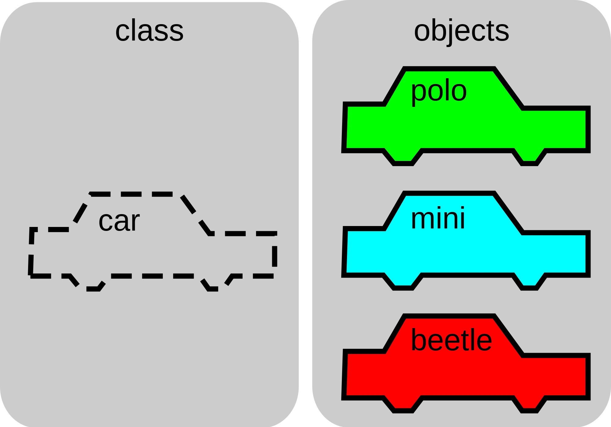

## Objektorientierte Programmierung

[Thema 5.5](README.md)

⚡[Anwesenheit bestätigen](https://moodle.medizintechnik-hf.ch/mod/attendance/manage.php?id=6139) und Webcam einschalten.

📖 Kapitel 11 Funktionen

---

### Code Aufbau

Bis anhin haben wir funktional programmiert.

Abhängig von der Projektgrösse muss man Code entsprechend aufbauen.

Python unterstützt auch die objektorientierte Programmierung (OOP).

---

### Daten und Code

Sie Idee von OOP ist die Bündelung von Daten (Variablen) und Code (Methoden)


---

### Objekte und Klassen

Es gibt neue Begriffe.

* **Klasse**: Bauplan oder wie soll das Objekt aussehen
* **Objekt**: Alles ist ein Objekt, beispielsweise Personen, Autos, Bäume, Häuser, Länder, Werkzeuge und Schuhe

---

### Beispiel Auto

Eine Veranschaulichung anhand des Objekts Auto.



---

### Modelierung der Realität

Mit OOP versucht man reale Objekte in Code auszudrücken.

Im folgenden wollen wir eine Kaffeemaschine programmieren.

---

### Eine Klasse definieren

🎬 Erstellen sie die Datei `Kaffeemaschine.py` mit diesem Inhalt:

```py
class Kaffeemaschine:
    def __init__(self, marke, anzahl):
        self.marke = marke
        self.anzahl = anzahl
    
    def Zustand(self):
        print(f"Ich bin eine {self.marke} Maschine")
        print(f"Es sind noch {self.anzahl} Kaffee(s) verfügbar")
    
    def Bestellen(self, anzahl):
        self.anzahl -= anzahl
```

---

### Objekt instanzieren

Nun erstellen wir anhand des Bauplans eine Kaffeemaschine.

🎬 Fügen sie diesen Code an:

```py
# Instanzieren
kaffeemaschine = Kaffeemaschine('Nespresso', 3)

# Methoden aufrufen
kaffeemaschine.Bestellen(2)
kaffeemaschine.Zustand()
```

---

### Lebenszyklus eines Objekts

1. Objekt instanzieren
	1. Konstruktor `__init__` aufrufen
2. Objektmethoden aufrufen
3. Objekt löschen

---

### Konstruktor

Die Initialisierung übernimmt der Konstruktor. Der Konstruktor ist eine Funktion mit dem Namen `__init__`.

```py
def __init__(self, marke, anzahl):
```

---

### Selbst

`self` bezieht sich auf das Objekt (die Instanz) selbst.

```py
		self.marke = marke
		self.anzahl = anzahl
```

---

### Methoden

Mit den Methoden, kann man mit dem Objekt interagieren.

```py
    def Zustand(self):
        print(f"Ich bin eine {self.marke} Maschine")
        print(f"Es sind noch {self.anzahl} Kaffee(s) verfügbar")
    
    def Bestellen(self, anzahl):
        self.anzahl -= anzahl
```

---

### Aufgaben 1

Lösen sie die ersten zwei Aufgaben.

⚡Aufteilung in Gruppen/Breakout-Rooms ⏱️ 10 Minuten

Ziel: Aufgabe 5.5.1 und 5.5.2 gelöst.

---

### Bestehende Python-Klassen

---

### Klassen- und Instanzvariablen

---

### Dekoratoren

---

### Getter- und Setter-Methoden

---

### Vererbung

---

### Hierarchie


---

### Abschluss

Ich hoffe das war nicht viel! Nun habt ihr die wichtigsten Element der Programmierung mit Python gelernt.

Jetzt heisst es anwenden!

---
