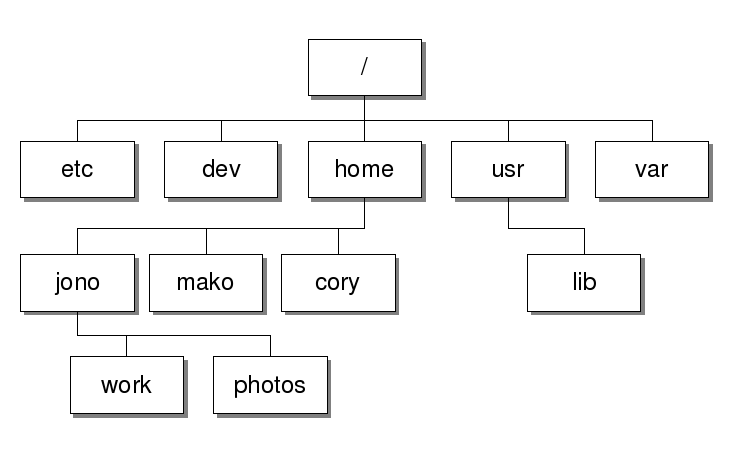
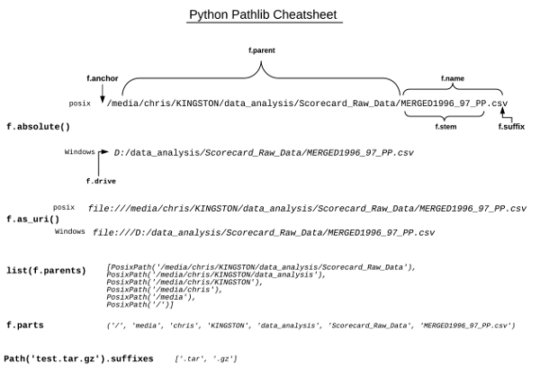
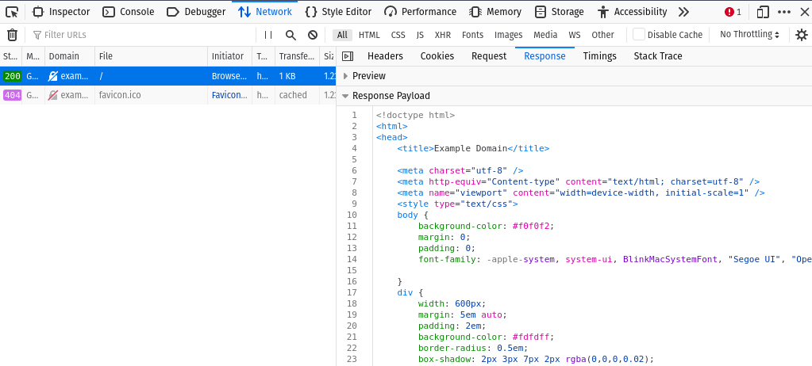
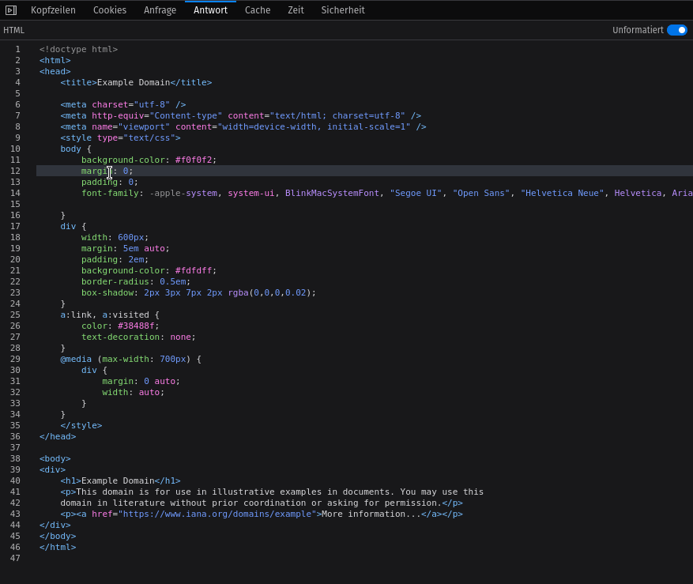

## Ein- und Ausgabe

[Thema 6](../README.md)

⚡[Anwesenheit bestätigen](https://moodle.medizintechnik-hf.ch/mod/attendance/manage.php?id=6139) und Webcam einschalten.

📖 Kapitel 10 Umgang mit Fehlern (Exceptions)
📖 Kapitel 14 Dateien lesen und schreiben  
📖 Kapitel 15 Netzwerkfunktionen

---

### Rückblick

Besprechung der Wiederholungsfragen.\
Fragen zur Wissensprüfung/Leistungsnachweis?

---

### Ausblick

Die Lektionen heute:
* Fehlerbehandlung mit Python
* Verschiedene Dateiformate lesen und schreiben
* Netzwerkfunktionen
* Erstellen HTML-Bericht

In der letzten Lektion bleibt Arbeitszeit für die Wissenprüfung/Leistungsnachweis.

---

### Achtung

Es werden einige neue Themen angeschnitten.\
Unbedingt melden, bevor es eine Crash gibt!

<iframe src="https://giphy.com/embed/5xrkJe3IJKSze" width="280" height="280" frameBorder="0" class="giphy-embed" allowFullScreen></iframe>

---

### Dateisystem

Auf dem Computer gibt es Dateien, Ordner und Metadaten (Erstellt am, Berechtigungen, ...).

Eine Datei liegt in einem Ordner. Die Datei und Ordner haben Metdaten.

Das Dateisystem ist hierarchisch aufgebaut.

---

### Hierarchie Linux


ℹ️ Auf Linux ist der oberste Ordner der `/` *Root* und bei Windows das `C:` Laufwerk

---

### Python Pathlib

In der Python-Biblitothek finden wir [`pathlib`](https://docs.python.org/3/library/pathlib.html). Mit Pathlib können wir mit dem Dateisystem interagieren.



---

### Thonny Vorbereiten

🎬 Führen sie diese Aktionen aus:
* Neuer Ordner `Thema6` erstellen
* Neue Datei `Verzeichnisse.py` in Ordner erstellen

---
### Aktuelles Verzeichnis ausgeben

🎬 Diesen Code einfügen uns ausgeben.

```py
from pathlib import Path
current = Path.cwd() # Gibt das aktuelle Verzichnis wo das Skript ausgeführt wird
print('Aktuelles Verzeichnis:', current.absolute())
```

ℹ️ Der Rückgabewert von `Path.cwd().absolute()` ist ein Objekt.

---

### Name des aktuellen Verzeichnis ausgeben

Erweitern sie das Beispiel mit:

```py
print(type(current))
print('Aktueller Verzeichnisname:', current.name)
```

---

### Fehlerbehandlung

Wenn eine Python-Anweisung einen Fehler generiert, kann man darau reagieren ohne dass das Programm abstürtzt.

🎬 Erstellen sie die Datei `Error.py` mit diesem Code:

```py
ergebnis = 1/0
print(ergebnis)
```

Zeile zwei wird nicht erreicht. Python gibt des Fehlertyp `ZeroDivisionError` aus.

---

### try and except

Mit den Befehlen `try` und `except` kann man versuchen eine Code-Block auszuführen und sobald dieser fehlschlägt darauf reagieren.

🎬 Ersetzen sie den vorhergehenden Inhalt mit:

```py
try:
    ergebnis = 1/0
    print(ergebnis)
except ZeroDivisionError:
    print("Man kann nicht durch Null teilen.")
```

---

### Except als Variable

🎬 Erstellen sie die Datei `Except.py` mit diesem Code:

```py
try:
    print(z)
except NameError as error:
    print(error)
    
try:
    print(z)
except:
    print("Ein Fehler im Code.")
```

---

### Fehler beim Zugriff auf Dateisystem

Der Umgang mit Fehler ist beim Zugriff auf das Dateisystem besonders wichtig.

Es gibt viele Fehlerquellen: ungültiger Pfad, Schreibschutz, ungültiger Dateiname, ...

---

### Textdatei schreiben

🎬 Erstellen sie die Datei `Schreiben.py` mit diesem Code:

```py
try:
    f = open('test.txt', 'wt')
    f.write('Lorem ipsum dolor sit amet, ...\n')
    f.write('Unicode äöüß✅ \n')
    f.close()
  
except BaseException as err:
    print('Fehler:', err)
```

ℹ️ Der Fehlertyp `BaseException` ist die Superklasse aller Fehlertypen.

---
### Textdatei lesen
🎬 Erstellen sie die Datei `Lesen.py` mit diesem Code:

```py
try:
    f = open('test.txt', 'rt')
    for line in f:
        print(line, end='')
    f.close() 
  
except BaseException as err:
    print('Fehler:', err)
```

---

### Unstrukturiert vs. Strukturiert

Wir haben eine unstrukturierte Textdatei erstellt. Im Umgang mit Daten und Kalkulationen brauchen wir ein besseres Format.


---

### JSON-Datenformat

*  JavaScript Object Notation (JSON) 
*  Beliebtestes Format für hierarchische Datenstrukturen
*  Syntax nahezu Deckungsgleich mit Listen und Dictionaries

---
### JSON-Beispieldatei

🎬 Erstellen sie die Datei `Bücher.json` mit diesem Inhalt:

```json
[
    {
        "title": "Raspberry Pi",
        "isbn": "978-3836265195",
        "authors": [
            "Kofler",
            "Scherbeck",
            "Kühnast"
        ]
    },
    {
        "title": "Docker",
        "isbn": "978-3836261760",
        "authors": [
            "Öggl",
            "Kofler"
        ]
    }
]
```

---

### JSON-Dateien verarbeiten

🎬 Datei `JSON.py` mit diesem Code ausführen:

```py
import json
with open('Bücher.json', 'r') as f:
    data = json.load(f)
print(data)
```

ℹ️ Mit der Anweisung `with ausdruck1 as var1, ausdruck2 as var2, ...: Code`  werden Ressourcen automatisch geschlossen. 

---

### JSON verabeiten

Der JSON-Inhalt kann ganz einfach verarbeitet werden.

🎬 Fügen sie diesen Code an:

```py
	for book in data:
	    print(f"Titel: {book['title']}")
	    for author in book['authors']:
	        print(f"Author: {author}")
	    print('')
```

---

### Dateiformate

Möchte man die Datei `Bücher.json` in einem anderen Programm bearbeiten wird es schwierig. Wir brauchen ein einheitliches Dateiformat.

---

### CSV-Dateiformat
* Comma-separated values (CSV)
* Textdatei zur Speicherung strukturierter Daten
* Kann mit jeder Tabellekalkulations-Software bearbeitet werden

---

### CSV-Datei schreiben
🎬 Erstellen sie die Datei `CSV.py` und fügen sie diesen Code ein:

```py
import csv

with open('Mitarbeiter.csv', mode='w') as file:
    file_writer = csv.writer(file, delimiter=',', quotechar='"')

    # Erste Zeile enthält die Tabellenüberschriften
    file_writer.writerow(['Name', 'Abteilung', 'Geboren im'])
    file_writer.writerow(['Peter Lustig', 'Buchhaltung', 'November'])
    file_writer.writerow(['Erika Meier', 'IT', 'März'])
```

ℹ️ Die erstellte Datei `Mitarbeiter.csv` kann mit einem Texteditor geöffnet werden.

---

### CSV-Datei lesen

🎬 Fügen sie diesen Code an:

```py
with open('Mitarbeiter.csv', newline='') as file:
    file_reader = csv.reader(file, delimiter=',', quotechar='"')
    line_count = 0
    for row in file_reader:
        # Erste Zeile enthält Tabellenüberschriften
        if line_count == 0:
            print(f'Spaltennamen sind {", ".join(row)}')
            line_count += 1
        else:
            print(f'{row[0]} arbeitet in der Abteilung {row[1]} und ist geboren im {row[2]}.')
            line_count += 1
    print(f'{line_count} Zeilen wurden verarbeitet.')
```

---

### Pause

⚡Wir machen eine Pause ⏱️ 20 Minuten

<iframe src="https://giphy.com/embed/iigcSmBaMUC5FoSUlu" width="280" height="280" frameBorder="0" class="giphy-embed" allowFullScreen></iframe>


---

### Aufgaben 1

Lösen sie die ersten zwei Aufgaben.

⚡Aufteilung in Gruppen/Breakout-Rooms ⏱️ 10 Minuten

Ziel: Aufgabe 6.1 und 6.2 gelöst.

---

### Dateien übertragen

Dateien wie wir sie gerade erstellt und gelesen haben, können über ein Netzwerk zwischen Computer übertragen werden.

Das Internet ist ein weltumspannendes Netzwerk von Computern.

---

### Dokumente im WWW

Eine Website ist nur ein Dokument. Das World Wide Web (WWW) bezeichnet alle Websites.

Mit einem Kommunikationsprotokoll übertragen Computer Websites als Dokumente.

---

### HTTP-Protokoll

* Hypertext Transfer Protocol (HTTP)
* Kommunikationsprotokoll für das WWW
* Browser rufen Webseiten über HTTP auf


---

### HTTP-Request anzeigen

🎬 Zur Betrachtung eines HTTP-Requests führen sie folgende Aktionen aus:
* Browser und einen leeren Tab öffnen
* Mit `F12` die Entwicklerkonsole aufrufen
* In der Konsole die Ansicht *Netzwerk* anzeigen
* In der Adressleiste `https://example.com` eingeben
* Den HTTP-Request mit Status `200` und Methode `GET` anklicken

---
### HTTP-Request Beispiel

Der HTML-Code der Webseite wird als HTTP-Response zurückgegeben.



---

### HTML-Dokument

Wird eine Website aufgerufen erhalten wir ein HTML-Dokument.

```html
<!doctype html>
<html>
	<head></head>
	<body>
		<div>
		    <h1>Example Domain</h1>
		    <p>This domain is for use in illustrative examples in documents. You may use this
		    domain in literature without prior coordination or asking for permission.</p>
		    <p><a href="https://www.iana.org/domains/example">More information...</a></p>
		</div>
	</body>
</html>
```

ℹ️ Bei HTML handelt es sich um eine Markup-Sprache.

--- 

### HTML

* Hypertext Markup Language (HTML)
* Auszeichnungssprache für strukturierte Dokumente
* Wird von Browser visuell dargestellt
* Grundlage des WWW

---

### Browser rendert HTML

HTML beschreibt wie ein Dokument aussieht und der Browser stellt es entsprechend dar. Diesen Vorgang nennt man *Rendern*.



---

### HTML-Dokument erstellen

🎬 Erstellen sie selber ein HTML-Dokument `Dokument.html` mit diesem Inhalt:

```html
<!doctype html>
<html>
	<body>
		<div>
		    <h1>Meine Website</h1>
		    <p>Das ist ein Paragraph</p>
		    <p><a href="https://python.casa">Hier lernst du aller über Python.</a></p>
		</div>
	</body>
</html>
```

---

### HTML-Tag


* **html**: Zeigt an, dass es sich um ein HTML-Dokument handelt
* **body**: Hier beginnt der Seiteninhalt
* **div**: Ein Block zum platzieren der Inhalte
* **h1**: Überschrift auf Stufe 1
* **p**: Ein Textabsatz
* **a**: Ein Link

---

### HTTP-Request mit Python

HTML-Dokument kann man mit Ptyhon herunterladen.

🎬 Erstellen sie die Datei `HTTP.py` und fügen sie diesen Code ein:

```py
import urllib.request

url = 'https://example.com'
response = urllib.request.urlopen(url)
binary = response.read() # Download durchführen
html = binary.decode('utf-8')
f = open('index.html', 'wt')
f.write(html)
f.close()

```

🎬 Öffnen sie die Datei `index.html` im Browser.

---
### HTML-Paket installieren

Damit man mit Python ein HTML-Dokument erstellen kann, braucht es ein zusätzliches Python-Paket.

🎬  Öffnet den Thonny Paketmmanager und installiert das Paket `yattag`.

Mehr zu [Yattag](https://www.yattag.org/).

---
### HTML-Dokument erstellen

🎬 Erstellen sie die Datei `HTML.py` und fügen sie diesen Code ein:

```py
from yattag import Doc

doc, tag, text = Doc().tagtext() # HTML-Funktionen abrufen

with tag('html'): # HTML-Dokumente mit den Elementen zusammenstellen
    with tag('body'): # Mit with werden Funktionsaufrufe aneinander gereiht
        with tag('p', id = 'main'):
            text('Beispiel')
        with tag('a', href='https://example.com'):
            text('Linktext')

html = doc.getvalue() # HTML-Code generieren

with open('example.html', 'wt') as file:
    file.write(html)
```

---
### HTML-Dokument im Browser öffnen

🎬 Fügen sie diesen Code an um die Datei direkt im Browser zu öffnen:

```py
# Die HTML-Datei im Browser aufrufen
import webbrowser
from pathlib import Path
webbrowser.open('file://' + str(Path('example.html').absolute()))
```

---

### Aufgaben 2

Lösen sie die ersten zwei Aufgaben.

⚡Aufteilung in Gruppen/Breakout-Rooms ⏱️ 10 Minuten

Ziel: Aufgabe 6.3 und 6.4 gelöst. Wenn möglich Aufgabe 6.5.

---

### Review

🎯 Ziele erreicht?
* Dateien schreiben, lesen und verarbeiten
* HTTP-Request ausführen
* Benutzeroberfläche erstellen

---

### Entscheidung****

Die restliche Zeit steht für diese Optionen zur Verfügung:

* Frage n zu Wissensprüfung
* Arbeit an Leistungsnachweis
* Repetition von vergangenen Themen

---

<!--
### Feedback

Habt ihr Feedbacks zum Kurs?\
Was hat euch gefallen und was nicht?\
Wurden die Erwartungen erfüllt?

---

### Abschluss

Ich wünsche gutes Gelingen bei den Projekten ☘️.

Bei Fragen oder Problemen dürft ihr euch jederzeit melden!

---
-->