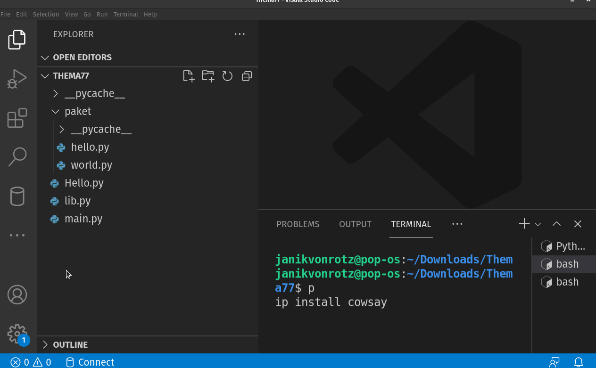
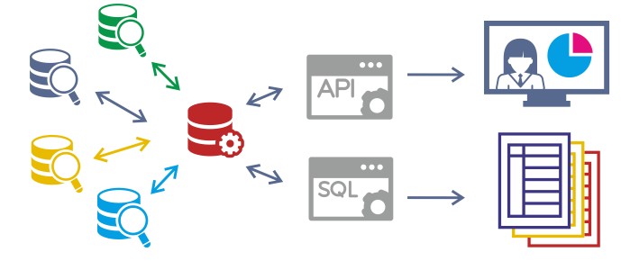
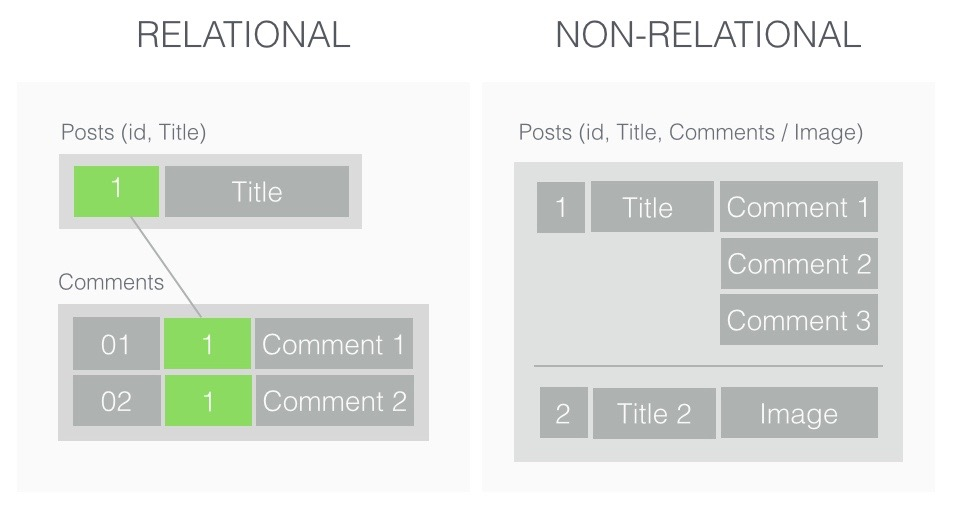

## Datenbanken

[Thema 7.5](./README.md)

⚡[Anwesenheit bestätigen](https://moodle.medizintechnik-hf.ch/mod/attendance/manage.php?id=6139)

📖 Kapitel 16.3 MySQL/MariaDB-Datenbankzugriff

---

### Rückblick

- Besprechen Wissensprüfung / Feedback
- Rückmeldung Projektvorschläge
- Beispiel Leistungsnachweis

---

### Pip Manager installieren

Mit ver VSCode-Erweiterung *Pip Manager* können sie *pip* Pakete verwalten.

🎬 Installieren sie die Erweiterung *Pip Manager* mit VSCode:




---

### Grosse Datenmengen

Wie man Text-Daten liest und speichert, wissen wir inzwischen. Im Umgang mit vielen Daten ergeben sie neue Fragen:
* Wie speichert man grosse Datenmengen?
* Wie stellt man sicher, dass in den Daten keine Fehler sind?
* Wie ermöglicht man den Zugriff für mehrere Programme auf dieselben Daten?

---

### Daten zentral speichern

Daten in einer Datenbank an einem Ort speichern.




---

### Was ist eine Datenbank?

>  Eine Datenbank ist ein System zur **elektronischen Verwaltung von Daten**. Die Kernaufgabe von Datenbanken liegt in der effizienten, dauerhaften und fehlerfreien Speicherung großer Datenmengen sowie in der bedarfsgerechten Bereitstellung benötigter Informationen.

ℹ️ Das Gegenteil einer Datenbank ist sozusagen Excel.

---

### Datenbanken bereitstellen

Auf einem Server installiert man ein Datenbankmanagementsystem.


Auf dem Desktop kann man direkt auf die Datenbank zugreifen.

---

### Welche Datenbanktypen gibt es?

Grundtypen

* **Relation**: Definierte Tabellen und Spalten, Abfragen und Manipulation von Daten nur in diesem Raster möglich.
* **NoSQL**: Schema ist freiher, dafür Datenkonsistenz nicht gegeben.



---

### Relationales Datenbankmanagementsystem

Es gibt verschiedene RDBMS. Wir interessieren uns für *PostgreSQL* und *SQLite*.

* **PostgreSQL**: Komplexes Datenbanksystem, dass auf Server installiert wird.
* **SQLite**: Ist im wesentlichen eine Datenbankdatei, die überall installiert werden kann.


---

### SQLite

Ist die meist verbreitete Datenbank-Engine[^1]. Sie ist auf jedem Smartphone installiert.


Wie viele andere Datenbanksysteme ist es SQL-basiert. Bei SQL (Structured Query Language) handelt es sich um die am meisten verwendete Datenbanksprache.

---

### Python und SQLite

Mit Python können wir eine SQLite-Datenbank erstellen und bearbeiten. Wir erstellen diese Lager-Tabelle:

| ID  | Name        | Referenz  | Barcode      | Lager | Preis |
| --- | ----------- | --------- | ------------ | ----- | ----- |
| 1   | Holztisch   | E-COM06   | 601647855633 | 3     | 147   |
| 2   | Bürostuhl   | FURN_7777 | 601647855634 | 1     | 70.50    |
| 3   | Abfalleimer | E-COM10   | 601647855649 | 5     | 43    |

---

### Vorgehen

Eine Datenbank wird in den folgenden Schritten erzeugt:
-   Anlegen der Datenbank
-   Anlegen von Datenbanktabellen durch Angabe der Struktur
-   Eingeben der Datensätze in die Datenbanktabellen

---

### Modul und Datentypen

SQLite wird über das Modul _sqlite3_ direkt in Python eingebunden. Es bietet standardmäßig die folgenden Datentypen:

-   **TEXT**: Für Zeichenketten
-   **INTEGER**: Für ganze Zahlen
-   **REAL**: Für Zahlen mit Nachkommastellen
-   **BLOB**: Für _binary large objects_, also große binäre Datenmengen
-   **NULL**: Entspricht _None_ in Python

🤔  Wie ordnen sie die Datentypen der Lager-Tabelle zu?

---

### VSCode vorbereiten

🎬 Führen sie diese Aktionen aus:
* Neuer Ordner `Thema7.5` erstellen
* Ordner mit VSCode öffnen
* Datei `lager.py` anlegen

---

### Datenbank-Datei erzeugen

Aktualisiert die Datei `lager.py` mit diesem Code:

```py
import os, sys, sqlite3

# Existenz feststellen
if os.path.exists("lager.db"):
    print("Datei bereits vorhanden")
    sys.exit(0)

# Verbindung zur Datenbank erzeugen
connection = sqlite3.connect("lager.db")

# Datensatz-Cursor erzeugen
cursor = connection.cursor()
```

---

### Tabelle erstellen

🎬 Mit SQL erstellen wir nun eine Tabelle. Fügt diesen Code hinzu:

```py
# Datenbanktabelle erzeugen
sql = """CREATE TABLE lager(
    id INTEGER PRIMARY KEY,
    name TEXT,
    referenz TEXT ,
    barcode TEXT,
    lager INTEGER,
    preis REAL)"""
cursor.execute(sql)
```

---

### Datensatz hinzufügen

🎬 Fügt diesen Code an um einen Datensatz zu erzeugen:

```py
# Datensatz erzeugen
sql = "INSERT INTO lager VALUES(1, 'Holztisch', 'E-COM06', '601647855633', 3, 147)"
cursor.execute(sql)
connection.commit()

# Verbindung beenden
connection.close()
```

---

### Datenbank anschauen

Mit dieser VSCode-Erweiterung können wir die Datenbank-Datei anschauen:


---

###


---

### Datensatz einfügen

---

### Daten anzeigen

---

### Daten filtern

---

### Datensatz löschen

---

### Aufgaben 1

Lösen sie die ersten zwei Aufgaben.

⚡Aufteilung in Gruppen/Breakout-Rooms ⏱️ 10 Minuten

Ziel: Aufgabe 7.5.1 und 7.5.2 gelöst.

---

### Ausblick

* Data Science mit Python
* Experte eingeladen 🙏 Alle anwesend

---

### Referenzen

[^1]: https://www.sqlite.org/mostdeployed.html